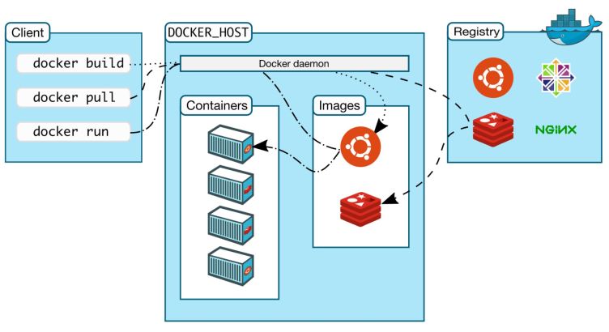

---
# You can also start simply with 'default'
theme: default
# random image from a curated Unsplash collection by Anthony
# like them? see https://unsplash.com/collections/94734566/slidev
# background: https://cover.sli.dev
# some information about your slides (markdown enabled)
title: "Docker: an overview"
info: |
  made for Data Science Retreat
  by Jacopo Farina

  Based on [Sli.dev](https://sli.dev)
# apply unocss classes to the current slide
class: text-center
# https://sli.dev/features/drawing
drawings:
  persist: false
# slide transition: https://sli.dev/guide/animations.html#slide-transitions
transition: slide-left
# enable MDC Syntax: https://sli.dev/features/mdc
mdc: true
---

<style>
h1 {
  background-color: #2B90B6;
  background-image: linear-gradient(45deg, #4EC5D4 10%, #146b8c 20%);
  background-size: 100%;
  background-clip: text;
  -webkit-background-clip: text;
  -moz-background-clip: text;
  -webkit-text-fill-color: transparent;
  -moz-text-fill-color: transparent;
}

.slidev-layout h1 + p {
  opacity: 0.9;
}
</style>

# Docker: an overview

Data Science Retreat

Jacopo Farina

<!-- <div class="pt-12">
  <span @click="$slidev.nav.next" class="px-2 py-1 rounded cursor-pointer" hover="bg-white bg-opacity-10">
    Press Space for next page <carbon:arrow-right class="inline"/>
  </span>
</div> -->

<!-- <div class="abs-br m-6 flex gap-2">
  <button @click="$slidev.nav.openInEditor()" title="Open in Editor" class="text-xl slidev-icon-btn opacity-50 !border-none !hover:text-white">
    <carbon:edit />
  </button>
  <a href="https://github.com/slidevjs/slidev" target="_blank" alt="GitHub" title="Open in GitHub"
    class="text-xl slidev-icon-btn opacity-50 !border-none !hover:text-white">
    <carbon-logo-github />
  </a>
</div> -->

<!--
The last comment block of each slide will be treated as slide notes. It will be visible and editable in Presenter Mode along with the slide. [Read more in the docs](https://sli.dev/guide/syntax.html#notes)
-->

---

# The problem of the state

Imagine you are developing an app/model/tool...

You try a library or a different version of Python, and:

* You cannot easily reconstruct what exactly is installed now and communicate it
* Different versions of the same thing are installed, and sometimes one or the
  other is used
* A newer version of a software X has been released, if you
  install X on a new machine, it’s not the same you used in
  development, and may break

<!-- <br>
<br>

Read more about [Why Slidev?](https://sli.dev/guide/why) -->

<!--
You can have `style` tag in markdown to override the style for the current page.
Learn more: https://sli.dev/features/slide-scope-style
-->


<!--
Here is another comment.
-->

---

# The problem of the state

You developed a software, (e.g. a web application) depending on a few libraries
and maybe requiring databases and frameworks installed on the system.

* Can you install it on a new machine and be reasonably sure it will work
  the same way?
* Can you make it easy for someone else to run it?
  (Or for yourself in the future)
* Did you update something? Now the change has to be replicated on each
  installation on the same way
* Are there manual changes (e.g. a config file was changed, some command
  copy-pasted and now forgotten)? Now the app behaves in different ways on
  different machines 😱😱
---

# What about security?

Everything you run can read/write your files, access the network, see other
processes.

This is a problem not only for *deliberate* attacks, but also trivial mistakes.

> Oops, my script runs `rm -rf /home/john /dataset.parquet`
>
> and now my home folder is gone ☠️

Isolating applications is useful in general

For example, I have multiple independent projects requiring a Postgres instance.
If I had a single instance on my computer everything would be mixed up, I prefer
to have a specific version of Postgres with a data folder whose size I can
monitor.

---

# What is Docker

* Runs a Linux process in an isolated and controlled way, in a so-called
  *container* (sometimes called *jail*)
* Can be used during development and/or production
* Prevents apps access to the "real" filesystem, network and processes
* Allows reproducible build and execution (no *works on my
machine* ™)
* Available for macOS and Windows using a virtual machine
* There is also a native Docker for Windows, but is not that common

---

# Other approaches

The problem is very common, many came with solutions to it:

* ***Conda*** isolates a Python environment. Almost only for Python, and may not
  cover all libraries.
* ***Nix*** is similar in scope, but focuses on reproducibility alone rather
  than isolation
* ***virtualenv*** similar to Conda, included in Python, no curated list of
  libraries

...and many more.

Docker is one of the **most common** solutions and tries to be **universal**.

Additionally, *containers* are the foundation of tools like Kubernetes or
 Compose, extremely common in enterprise environments.

---

# Server and client

The daemon (dockerd) is the process that manages all docker resources
* Also known as engine
* On macOS and Windows, it runs in a Linux VM

The Docker client (docker) is the primary way that Docker users interact with
the Daemon
* Can run directly on non-Linux system
* Communicate with the engine via HTTP

In our case, the daemon and the client will be on the same machine: our
laptops!

---

# Images and containers

An image is a template to create containers to run. Most importantly, it
contains all the files visible to the running app (including libraries and
intepreters).

Roughly, you can see the image as a copy of the disk of a computer with some
app installed and ready to use.

There are repositories of useful public images, for example at hub.docker.com
and **private** repositories for companies.

A container is a running image, you can have multiple containers from the
same image.

Every container is based on one and only one image, but an image can be
executed in many different containers

> Can be useful to see an image like an app you can double-click multiple times,
 getting multiple windows (containers), independent from each other and with
 their own state.

> The image defines the initial state of a container and does
 not change across excutions.

---

# Recap:



---

# Enough talk, let's see this in action!

Let’s say we want to check how this code behaves in different Python versions:

```python {monaco}
print(f'this is {3+2}')
```
installing Python 3.5 and 3.12 on the same machine is boring and can be messy.

It's a good use case for Docker: we want to isolate the environment.

> Another way to see it is to think about phone apps:
 you can install an app and it will not affect other apps, when removed is gone

---

# Step 1: find the image details

Since this is Python, a very common language, we safely assume there's an image
somewhere in the public registry.

Go to [hub.docker.com](https://hub.docker.com/) and search for python.


Image names are represented this way:


 ```{docker hub username}/{image}:{tag}```

If the tag is omitted, it is `latest` by default

When an image is official, you can omit the username.

In this case `python:3.5` is what we need (username is omitted because it
 is an official image)


---

# Step 2: download the image

Use:

* `docker pull` to download an image
* `docker images` to list the downloaded images
* `docker rmi` to delete an image

Notice that images are versioned and have an hash.

Docker commands accept both the image name or the hash.

---

# Step 3: run a container from the image

Use:

* `docker run` to start a container from an image

  Some essential flags:
  * `-it` to run it in interactive mode
  * `--rm` to delete upon exit
  * `--name` to give it a name (if not, it uses a random one)
* `docker ps` to see the running containers
* `docker stop / kill / rm` to stop and delete the containers
* `docker inspect` to see all the details (lots of details, useful for troubleshooting)
* `docker system prune` can delete all stopped containers to save space

---

# Let's play with the filesystem

Create a container with:
`docker run -it --rm --name mypython python:3.9`
* Use `docker ps` in another window to see the running container
* Use `docker exec -it mypython bash` to start bash in this container,
 and write to a file
* You can also use `docker run -it --rm --name mypython python:3.9 bash` to start
bash instead of python in a container
* Can you read the file from python?
* What happens if you start another container, is the file there?

Hint: If you miss the `--rm` flag you can use `docker ps -a` to see stopped
containers, `docker rm` to eliminate them

---

# Each container has its own filesystem

From "inside" a container, you see the filesystem *initialized* from the image.

A container can modify files, but changes are only for that container and
are ephemeral.

This is **by design**, to make every process **reproducible**.

If you need to configure/install components not provided by the image, you
need to create your own image (we are going to see this).

What about datasets and models?
You can mount **volumes** to process data from the outside

---

# Mount volumes and folders

Sometimes you actually want to read/write files from a container and make them
persistent.

Use the `-v` flag to **mount** volumes or folders when you start a container.

add `-v myvolume:/my_mount_point` to add a volume called "`myvolume`" and make it
visible under `/my_mount_point`.

Use a path (absolute, starting with `/`) instead of a volume name to mount a
folder from your computer.

Tips:

* You can add `:ro` to make the mount read-only (`-v myvolume:/mountpoint:ro`)
* Files created from containers on mounted folders can have weird permissions
metadata, if needed use `chown` and `chmod` to fix them
* You can use `-v` multiple times to mount multiple volumes
* Trick: you can use `docker cp` to copy files in and out from containers, if
 you forgot to mount a volume
* Trick 2: you can use `docker diff` to see which files where touched by a
 container

---

# See the output

The `-it` flag starts an intractive container, while `-d` starts one in
 background.

You can try it easily with
 `docker run -d --rm --name pinger python:3.5 ping google.com`.

Now you can use `docker logs -f pinger` to follow the logs (Ctrl + C to quit).

Additionally, `docker attach pinger` tries to "reconnect" to an existing
 container.

Server applications like databases or Ollama usually are executed in background
 and expect connections from clients rather than being used from the shell.

---

# Environment variables

A container does not see the system environment variables

It receives the environment variables defined in the image, additional
environment variables can be passed using the -e flag when running a container.

This is a common way to pass the configuration (API keys, password, etc.),
 another one is to mount volumes with the secrets as files.

`docker run -it --rm -e BLA=5 python:3.5 bash`

now `echo $BLA` inside the container will show the value, every process in the
 container can read it.

---

# Intermission: networking

Before seeing how Docker handles networking, let's see the basic concepts of
 how to represent connections and services *in practice*.

This is **essential** knowledge even outside Docker.

We'll skip many details for simplicity.

---

# Intermission: networking

### IP addresses and hostnames

Each node in a network (really each `interface`) receives an IP address
identifying it, e.g. `192.168.1.7`. For convenience, there are tools
(like the `DNS`) to map IPs to names like `google.com` or `localhost`.

Use `ping someaddress` to see the IP associated ("resolved") to an hostname.

In a common setup (at DSR or in a company or at home) you have three IPs you
 care about:

* `127.0.0.1`, also called `localhost`. A special address referring to yourself,
 in a Docker container is the container itself rather than the whole machine

* A private/local address, like `192.168.1.7`, valid only within the same network.
 You can see it with the command `ip addr show` or `ifconfig`, `ipconfig` on
 Windows. Some networks are configured to not allow communication between nodes.
 It's the address you use for example for a local printer.

* An internet/public address, assigned to the router. Usually same for all the
 computers in the network, you can see if for example at
 [whatismyip.com](https://www.whatismyip.com/)

---

# Intermission: networking

When you run an application, e.g. a web app, you can then connect in different
 ways:

* Using `localhost` / `127.0.0.1` to test it on the same machine (or container)
* Using the private address to share it across the same network, if allowed
* If deployed on a server with a dedicated public address, that address. May have
 to be purchased, depends on the hosting service

A few tips:

* You can rent a domain name to map to your IP address
* For testing, tools like `ngrok` or `bore` temporarily expose something local
 to a public address
* Many servers need to be **told** to listen on all available IPs. `0.0.0.0` is
 a "special" IP to indicate that every available interface is being used.
* These details are for IPv4, IPv6 are still uncommon but the same principles
 remain valid

---

# Intermission: networking

### Ports

IPs identifies a computer (well, an interface really), but a computer can run
 different services at the same time. To tell them apart, you have also a `port
 number` between 1 and 65536.

When you visit an address like `http://localhost:3000` you are connecting not
 just to `localhost` but to the specific service using port 3000. When you use
 a web server tool like Streamlit or Flask or Fastapi you have to specify a
 port or get a default one.

A few notes:

 * Some port numbers are standard and may be omitted. For example `http` implies
 port 80, `https` is port 443, so `http://john.com` is using port `80` by
 default
 * You may have already something using some ports, e.g. AirPlay may use 8000
 * Starting a server ("listening") on ports below 1024 requires root permissions
 and is usually a bad idea because they are likely associated with
 standard services.
 * Commands like `lsof` or `netstat` can show who's using which port, also the
 GUI usually shows it

---

# Networking in Docker

Docker isolates the network as well!

* Each container by default has an IP address (visible with `docker inspect`)
 which makes sense only locally
* Use `-p 8090:3000` to expose port `3000` of the container to the port `8090`
 of your computer. The container "believes" it's using 3000, but
 `localhost:8090` will show it.
* On Docker Desktop / rancher desktop you also have the VM in the middle, so
 may need extra config depending on the case.

---

# Let's try it

Did you know Python comes with an incorporated web server?

Yep, try `python3 -m http.server`. You can specify a port with
 `python3 -m http.server 4567`.

This is very useful when doing frontend development or to share files.

Try it locally and in Docker, you should be able to use `-p` to make it visible
 on the

Note: there are many tools like this from Python, see https://docs.python.org/3/library/cmdline.html

---
dragPos:
  square: 56,1888,0,0
---

# A more complete example: Postgres

Go to the Docker Hub and follow the instructions to start a Postgres server.

Should be something like:

`docker run --name some-postgres -e POSTGRES_PASSWORD=mysecretpassword -d postgres`

now you can connect from within the container using `docker exec`.

The command to open a postgres shell is
`psql postgresql://postgres@ipaddress:port`, the port by default is `5432` and
can be omitted if that's the case.

This is a *real* postgres instance, you can use it from DB clients or Python
libraries. You have to mount a volume to persist the data, though.

---

# Another example: run an LLM locally

You can run many models using Ollama:

`docker run --rm -d -v /my/home/model/path:/root/.ollama -p 11434:11434 --name ollama -it ollama/ollama`

then open a shell to chat with it:

`docker exec -it ollama ollama run llama3.2`

The same instance can be used via the Python library, connecting to the
 port 11434.

---

# Docker Compose

Often you want to run multiple containers together:

* start and stop all of them in a single command
* specify an order to start them (e.g. first a database, then an app using it)
* see the log of all of them combined

for that, writing multiple long `docker run` commands is tedious and
 error prone.

Docker compose automates this. You can describe the containers of your setup in
 a `compose.yaml` file. Then, commands like `docker compose up` and
 `docker compose down` start and stop them together.

See a few examples https://github.com/docker/awesome-compose/tree/master

---

Example: Flask + Redis

https://github.com/docker/awesome-compose/tree/master/flask-redis

```yaml  {monaco}
services:
  redis:
    image: redislabs/redismod
    ports:
      - '6379:6379'
  web:
    build:
      context: .
      target: builder
    # flask requires SIGINT to stop gracefully
    # (default stop signal from Compose is SIGTERM)
    stop_signal: SIGINT
    ports:
      - '8000:8000'
    volumes:
      - .:/code
    depends_on:
      - redis
```

---

# Kubernetes

Kubernetes (K8s) behaves as a sort of "distributed Docker", used in complex setups to
 run containers in a cluster.

It uses a YAML definition of the configuration you want to deploy. You can test
it using tools like `minikube`.

Examples of what K8s can do:

* **Cronjobs**: run a container according to a schedule
* **Load balancing**: run multiple copies of a container, split the workload
* **Secrets**: make tokens and config available at runtime
* **Autoscaling**: rent machines from AWS or similar when needed
* **Authentication/namespaces**: handle multiple users with different permissions
 and quotas (e.g. how much RAM per team)

---

# Building an image

So far, we **used** images from the docker hub.

There are many for the most common open source tools and libraries, but what
if you want to **create** one with your own code?

That way, you can allow another user (or yourself) to run it using a single
 command, without worrying about they having different versions of the
 dependencies.

It can also be useful during development, to quickly build and test some code
 in a reproducible way.

---

# Building an image

Docker allows you to build an image, and run containers based on that.

An image can be used locally, but can also be published on the Docker Hub or
private registries.
It’s possible to snapshot a container FS to get an image, but not recommended
 because it’s much harder to maintain and rebuild.

Instead, the traditional way is to define a `Dockerfile`.

This file is basically a recipe to build an image, a list of steps which are
 executed one by one.

---

# Dockerfile: an example

```dockerfile {monaco}

FROM ubuntu:24.04

RUN apt-get -y update && \
    apt-get -y install python3

COPY hello.py /opt/hello.py

CMD ["python3", "/opt/hello.py"]

```

you can find this example under `example_dockerfile_1`

Build it by going to the folder and running `docker build -t myimage:0.1 .`

Run it with `docker run myimage:0.1`

You can now see it with `docker images`

Using `docker tag` you can assign extra names to the same images, same principle
 as git branches. Images also have a unique hash based on the content and can be
 used instead of a tag, just like git commit hashes.

---

# Let's dockerize a Flask app

Let's implement a Flask app that will use NumPy to generate a random number and
show it in a web page.

This requires:

1. Getting an idea of how a general web app works
2. Handling dependencies (numpy)
3. optional: Using venv to quickly test it without docker
4. Wrap everything inside a Dockerfile, build the image, and run the container

---

# HTTP - HyperText Transfer Protocol

A browser or client sends a **request** and the server replies with a
 **response**.

You can peek on them in the browser (right click -> `inspect`, the network tab).

Requests have:

* **headers**: metadata about the request itself (cookies, language, etc.)
* **verb**: the type of request. GET, POST, PUT, etc.
* **payload** (or **body**): data you send in a request, if any

Responses also have headers, and they have a **status code**:

> 2xx for OK, 4xx for client error, 5xx for server error, 3xx for redirect

Usually the browser requests a page, and the page content triggers further
 requests for resources (images, scripts, etc.) listed in the page.

Requests are always intiated by the client, but it's possible to open a
 websocket or poll continuously to let the server push data too, e.g. for chat
 applications or auto-refresh.

---

# Create a venv, install Flask

```bash  {monaco}
# create the venv
python3 -v venv .venv

# activate it
source .venv/bin/activate

# install Flask (will affect the active venv)
python3 -m pip install Flask
```

you can check which "python" will be used with `type python`.

Now if you open a python shell and run `import flask` it will work.

You can see the list of installed libraries with `python3 -m pip list`. This
 shows not only Flask but other libraries that are indirect dependencies.

---

# A minimal Flask app

In `minimal.py`:

```python  {monaco}
from flask import Flask

app = Flask(__name__)

@app.get("/a")
def hello_world():
    return "<p>Hello, <strong>World!</strong></p>"

```

now run `flask --app minimal run` and you can see it in the browser.

---

# requirements.txt

We need to track the libraries used by our app and their versions.

Tools like `Poetry` or `PDM` can handle that for you in a `pyproject.toml`, and
 automate most common operations. Unfortunately Python is quite messy when it
 comes to packaging.

Without extra tools, a simple solution is to use `venv` and list the
dependencies in a `requirements.txt` file.

write it:

`python3 -m pip list --format freeze > requirements.txt`

use it:

`python3 -m pip install -r requirements.txt`

---

# Add NumPy

As an example of a "data science-y" library, add NumPy

```python {monaco}
from flask import Flask
import numpy as np

app = Flask(__name__)

@app.get("/random")
def random():
    return f"Random number: {np.random.random()}"
```
---

# Dockerize it

Now we can replicate the setup in a Dockerfile, to build an image with all the
logic.

Try to write the Dockerfile yourself

Tips:
* For a starting image you can use python, or ubuntu and then install python
* You don’t need the virtualenv, install on the whole container because the
 isolation is already provided by Docker. Use the `requirements.txt` directly
* Comment out part of the Dockerfile, build so far and run bash on the image
 for troubleshooting
* The `--host` flag for Flask is not always needed. Use `docker exec` and then
 `curl` to call the app from inside the container and figure out if it works
 there
* On a production setup, we would use guvicorn or similar. Not relevant here,
 it adds a bit of complexity but the logic remains the same