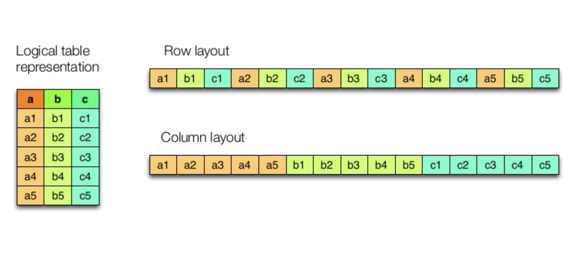

---
# You can also start simply with 'default'
theme: default
# random image from a curated Unsplash collection by Anthony
# like them? see https://unsplash.com/collections/94734566/slidev
# background: https://cover.sli.dev
# some information about your slides (markdown enabled)
title: "Data formats and NoSQL: an overview"
info: |
  made for Data Science Retreat
  by Jacopo Farina

  Based on [Sli.dev](https://sli.dev)
# apply unocss classes to the current slide
class: text-center
# https://sli.dev/features/drawing
drawings:
  persist: false
# slide transition: https://sli.dev/guide/animations.html#slide-transitions
transition: slide-left
# enable MDC Syntax: https://sli.dev/features/mdc
mdc: true
---

<style>
h1 {
  background-color: #2B90B6;
  background-image: linear-gradient(45deg, #4EC5D4 10%, #146b8c 20%);
  background-size: 100%;
  background-clip: text;
  -webkit-background-clip: text;
  -moz-background-clip: text;
  -webkit-text-fill-color: transparent;
  -moz-text-fill-color: transparent;
}

.slidev-layout h1 + p {
  opacity: 0.9;
}
</style>

# Data formats and NoSQL

Data Science Retreat

Jacopo Farina

<!-- <div class="pt-12">
  <span @click="$slidev.nav.next" class="px-2 py-1 rounded cursor-pointer" hover="bg-white bg-opacity-10">
    Press Space for next page <carbon:arrow-right class="inline"/>
  </span>
</div> -->

<!-- <div class="abs-br m-6 flex gap-2">
  <button @click="$slidev.nav.openInEditor()" title="Open in Editor" class="text-xl slidev-icon-btn opacity-50 !border-none !hover:text-white">
    <carbon:edit />
  </button>
  <a href="https://github.com/slidevjs/slidev" target="_blank" alt="GitHub" title="Open in GitHub"
    class="text-xl slidev-icon-btn opacity-50 !border-none !hover:text-white">
    <carbon-logo-github />
  </a>
</div> -->

<!--
The last comment block of each slide will be treated as slide notes. It will be visible and editable in Presenter Mode along with the slide. [Read more in the docs](https://sli.dev/guide/syntax.html#notes)
-->

---

# Data Formats

When you want to store data or **exchange** it, you have to choose a format.

Examples: JSON, CSV, Avro, Parquet, etc.

This depends on:

* performance: read/write speed, space taken by the file
* typing and schema: how nicely the format represents data, and prevents errors
* ease of usage for people using other languages/libraries or non-technical

---

# Example data

<<< @/snippets/sample_data.json json

notice that Nauru has no capital here, and population is a number, not a string

---

# JSON (JavaScript Object Notation)

Used in the web and by APIs, very simple, can be **written by hand**.

<<< @/snippets/read_write_json.py python

Notice that the tuple and the list become the same thing.

Can handle structured data, Python can handle it with the `json` module in the
standard library, for fancier need you can use `orjson`.

Pretty much every language can read and write JSON.

---

# CSV (Comma Separated Values)

Every line contains values separated by a comma. Sometimes it's instead a
 semicolon (`;`) or a tab (then it may be called `tsv`).

Python can read/write it with the `csv` module:

<<< @/snippets/read_write_csv.py python


...but usually you use Pandas/Polars/DuckDB for this

Useful to interface with non-technical users, as they'll use Excel.

---

# CSV vs JSON

CSV pros:
 * easy to exchange data with non-technical people or old tools
CSV cons:
 * hard to understand without headers
 * not truly standardized, how to escape strings?
 * no unstructured data

JSON pros:
* very easy to read/write manually
* can handle structured data (e.g. the capitals before)
* ubiquous, it's the lingua franca of the wb

JSON cons:
* cannot be handled directly by Excel

---

# Enter: Data Types and Schemas

Look at the Python snippet from before:

<<< @/snippets/read_write_json.py python {all|4}

this is actually a string, and processing it as a number (e.g. calculating a
 max) will crash the application.

A database would have refused such a value immediately, because it has a schema.

Same if you wrote a date like `2024-02-30`, not to mention the US format.

Also, if you know the value is a positive number you can represent it with a
 lot less bytes.
In this case, 4 bytes for numbers up to 4 billions, as text would be 10.

---

# Data types and schema

<<< @/snippets/timestamp_size_comparison.py python


They represent the same thing, the float representation is much smaller and
 faster to process, and the compression is particularly effective (e.g. 10-20x)
 when you have a sequence of values.

To make sense of it however you need to know that the number is a timestamp.

This is the kind of information that you find in a **schema**.

---

# What is a schema

A schema is a definition of the fields of an entity.

You already saw schemas in SQL (the table definition), maybe in Python too (
 Pydantic/FastAPI, named tuples, dataclasses, etc.).

A schema usually defines:
* the **type** of a field (string? integer? timestamp?)
* name, documentation for humans
* whether a field is optional or not
* possible values (enum)
* composite types (e.g. "this is a list of objects with these schemas", "either
 this or that schema")

Having a schema prevents trivial errors, assists with documentation and
 autocompletion, and can be used to read/write data very effectively.

---

# Binary formats

We saw that a timestamp takes less space if serialized as a number, similar
 optimizations are possible for most data.

Given a schema you could automatically write only the bytes you need and make
 sense of them.

These 27/54 bytes
```json
{"name": "john", "age": 38}
```
could become 6:
```text
john &
```
the less bytes, the less space on disk and time to read/write or transmit.

A binary format does that, the main drawbacks are that it's not human readable
 and may not be easy to exchange across libraries/languages.

---

# Many binary formats

* Thrift
* Avro (Hadoon, Spark, Kafka)
* Protobuf/Flatbuf (Pokemon Go, vectorial maps)
* Parquet (Hadoop, Spark, Snowflake, Flixbus)
* Arrow (new one, often combined with Parquet, focuses on computation in
 addition to serialization)

And many many more, we are going to see **Avro** and **Parquet**, right now
 the most relevant for data science.

Arrow is used implicitly within Parquet, it's an extremely interesting
 technology because it tries to process data without changing format, and is
 designed to take advantage of modern hardware (multicore and somtimes GPUs).

Tools like Polars (and Pandas after 2.0) can take advantage of it.

---

# Avro

> Row-oriented remote procedure call and data serialization framework developed
 within Apache's Hadoop project. It uses JSON for defining data types and
 protocols, and serializes data in a compact binary format.

Let's translate it:

* Row-oriented: when you have tabular data it represents one record, then
 another, then another, going row by row
* Remote procedure call: defines services using data in addition to the data
 itself
* Apache Hadoop: distributed computing tool made in Java

---

<<< @/snippets/avro_weather_example.py python

---

<<< @/snippets/avro_weather_example_part2.py python


---

# What about schema checks?

<<< @/snippets/avro_weather_example_part3_error.py python

```text
ERROR - unsupported operand type(s) for <<: 'str' and 'int'
Traceback (most recent call last):
  File "<ipython-input-9-52ead7c5d03e>", line 12, in <module>
    writer(out, parsed_schema, records)
  File "fastavro/_write.pyx", line 600, in fastavro._write.writer
  [...]
  File "fastavro/_write.pyx", line 57, in fastavro._write.write_int
TypeError: unsupported operand type(s) for <<: 'str' and 'int'
```

---

# Apache Parquet

More recent than Avro, represents data in columns instead of rows.

Often combined with Arrow.

Pandas (and Polars and DuckDB) can read/write it provided you installed
 `pyarrow`

---

# Layout: Column vs Row

(Sorry for the grainy image, could not find vectorial)



---

# Layout: Column vs Row

### Why do we care about it?

The difference lies in how quick it is to access a single row or a single colums.

* **Row layout** makes it easy to access a row, to read/write a single entity.
  * E-commerce
  * Web apps
* **Column layout** makes it easy to access all the data in a column at once
  * Reporting (e.g. average of a field)
  * Analysis

Accessing a single element of a set, not reading in order, is called "random
 access" (the `R` in `RAM`).

It's not random of course, it means it cannot be predicted by the system
 providing the access (a database, a disk, etc.).

---

# To recap

* Use CSV as a simple way to interact with non-technical users
* Use JSON as a universal language for APIs and services and config
* Use Parquet to store tabular data for yourself
* Avro is often used with Kafka
* Protobuf is often used in network applications requiring speed (e.g.
 videogames and maps)
* Column vs Row layout depending on the use case (random access or analytic)

---

# SQL

So far, we saw SQL based relational ACID-transactional databases
 (like MySQL and Postgres).

* **SQL**: the language used to query and manipulate the data
* **relational**: data is represented in tables (also called "relations"),
 each table has a schema that repeats for each row. It's not a graph, or
 documents without a schema
* **ACID-transactional**: every operation happens in a `transaction`,
 transactions are guaranteed to be completely done (`commit`) or completely
 undone (`rollback`).

 > **ACID** = **A**tomicity **C**onsistency **I**solation **D**urability

The data is almost always represented with a row layout, optimized for random
 access.

This is by far the most common type of database: Postgres, MySQL, Oracle,
 SQLLite, DB2, SQLServer, DuckDB...

Also, **PostGIS**.

---

# NoSQL

There are cases when we prefer to sacrifice common features of traditional
 databases to increase performances for a specific use case.

There are many reasons and techniques to do it, and the term NoSQL covers them
 very broadly:

* schema-less
* graph databases
* key-value storage (think about a Python dictionary)
* "eventual" consistency (no transactionality)
* column-based layout

most of these databases also don't use SQL but some variation or no language at
 all, hence the name. Now interpreted as "not only SQL".

NoSQL was very hyped in 2010s, now a lot less but there are applications that
 survived the hype cycle.

---

# No schema: document databases

For example we don't have a schema, we store JSON **documents**.
Easier to do but can be a powerful "footgun".

Examples: MongoDB, CouchDB, CouchBase

Note that Postgres and others support JSON columns.

---

# Graph databases

Represent data in terms of nodes and edges, which can have properties.

Probably **neo4j** is the most common.

Ideal to handle graph data (duh!), like social networks, users-products
 recommendations, ontologies, road networks...

Usually support graph algorithms out of the box: shortest path, pagerank, cycle
 detection, Tarjan SCC, etc.

---

# Tradeoff between consistency and performance

You cannot have consistency and performance at the same time, especially with
 multiple servers.

* You block everyone until every transaction is replicated across nodes? You
 sacrifice performance
* You let everyone read whatever is available? Consistency is gone

Sometimes this is referred as **CAP theorem**, but that refers to distributed
 systems and what happens when the servers are disconnected or delayed.

As a solution you can also arrange data so that it's trivial to split across
 servers, then it's easy to distribute but you cannot access it in some ways
 (e.g. JOINs or grouping or massive updates).

It's always a tradeoff.

---

# Key value storage

Represent all the data like a big Python dictionary:

* given a key, fetch the corresponding value
* given a key and a value, store it under that key

**Redis** is an in-memory database that can do it. Very performant, used to
 store data for immediate usage.

E.g. caching, work queues, chat presence, multiplayer games

Redis can optionally persist data on the disk, if needed, but it's not the
 usual use case.

---

# Distributed key-value

Due to the simple "atomic" nature of key-value pairs, it's easy to partition
 keys across servers and distribute the load this way.

Examples: Cassandra, DynamoDB, Hive

> Imagine a library with books arranged by author's first letter and lots of
 people wanting to deposit or fetch a book. You can split the load across 26
shelves (servers/nodes) and multiply by 26 the "performance" of a single one.

> This is possible only as long as you have a key (the author name in this case)
 that can always be used. If you need to search by publisher or year or book
 title it does not work anymore.

> Also, transactionality now can be managed on the single shelf, handling one
 book at a time. No transactionality on multiple entries.

> Servers (shelves) can be added on the fly to handle increased workloads

Data is usually copied across multiple servers, so adding and removing nodes
 while it runs causes no downtime.

---

# Columnar databases

Remember the row vs. column layout we mentioned? The same consideration applies
 to databases.

Columnar databases store data in columns internally.

Usually the queries are written in SQL, but the database is optimized for
 analysis rather than random access.

It's ideal for reports/analysis.

Many companies do have a row based DB for operations, and a regular dump in a
 column based one for reports.

Examples: Redshift, BigQuery, DuckDB, Vertica

Also there are extensions to have column-based tables on Postgres or MySQL.

---

# Quiz time!

We are going to see a few use cases, and discuss which database would be the
 best:

* classic SQL database
* columnar database (may also be SQL)
* memory Key Value
* distributed Key Value
* graph database
* document database

---

<h1>
An application that needs to store the most recent products viewed by each user
on Amazon.de
</h1>

---

<h1>
An application to manage a blog with blog posts, tags,
comments, etc.
</h1>

---

<h1>
Storing the "last seen online" timestamp of users in a chat app
</h1>

---

<h1>
Storing the pages scraped from a website
</h1>